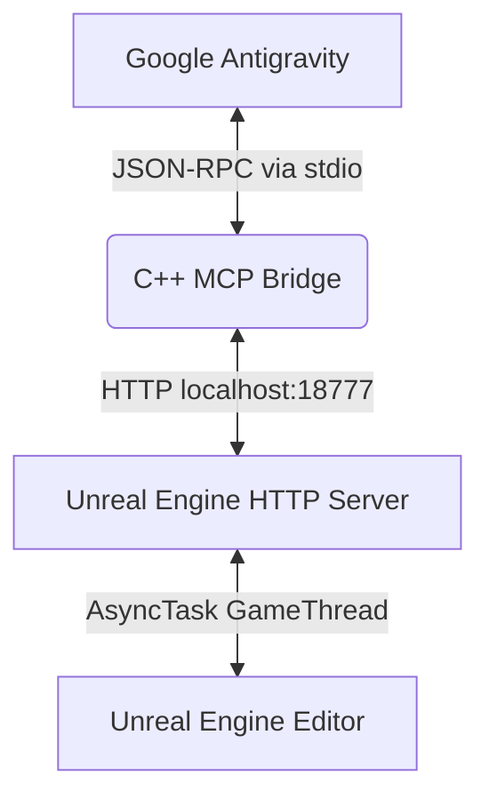

# UE-Antigravity

**UE-Antigravity** is a high-performance integration that connects the Google Antigravity AI coding assistant directly to a running Unreal Engine Editor.

Exposed as a Model Context Protocol (MCP) server, it enables Antigravity to interact natively with your Unreal Engine projects, query schemas, run diagnostics, modify code, execute editor automation, and build Blueprints dynamically on the Game Thread.

---

## Key Features

Exposes **70+ advanced editor tools** categorized into specialized domains:

* **Blueprint Generation**: Create Blueprint actors, add variables/functions, connect pins, and inject node graphs.
* **Widget & UMG Editor**: Retrieve widget hierarchies, modify widget slots, set fonts, and bind interactive events.
* **C++ Integration**: Create classes, modify header and implementation source files, and trigger Live Coding compilation.
* **Python Editor Scripting**: Write and execute native Unreal Python scripts inside the editor process.
* **Performance & Scalability**: Read/write cvars, analyze asset sizes, run CSV profiling, and capture rendering metrics.
* **Enhanced Input**: Define input actions, manage input mapping contexts, and bind hardware mappings.
* **Gameplay AI & World Tools**: Edit Blackboard/Behavior Tree graphs, configure NavMesh bounds, and spawn actors.

---

## Repository Structure

This repository contains two distinct components that work together, separated into their own directories for easy distribution:

1. **[Antigravity](./Antigravity)** - The Unreal Engine Editor plugin. It runs an in-process HTTP loopback server to execute commands safely on the Game Thread.
2. **[UnrealEngine](./UnrealEngine)** - The Antigravity extension plugin (MCP Server). It registers the tools with the AI assistant and proxies JSON-RPC messages via a lightweight C++ bridge to the Unreal HTTP server.



---

## Installation & Setup

You must install both components to use the integration.

### 1. Unreal Engine Plugin (Antigravity)

1. Create a `Plugins` directory at the root of your Unreal Engine project if it doesn't already exist.
2. Copy the `Antigravity` folder from this repository into your project's `Plugins` directory.
3. Open your project in Unreal Editor, click **Yes** if prompted to rebuild, and ensure the plugin is enabled in **Edit > Plugins**.

*For more details on the Unreal Engine plugin, please see the [Antigravity README](./Antigravity/README.md).*

### 2. Antigravity Agent Plugin (UnrealEngine)

**Workspace Level (Recommended)**
Copy the `UnrealEngine` folder into the `.agents/plugins/` directory at the root of your active project workspace:
```bash
mkdir -p .agents/plugins
cp -r UnrealEngine .agents/plugins/
```

**Global Level**
Alternatively, for global installation, copy it to your user profile's global configuration directory:
* **Windows:** `C:\Users\<Username>\.gemini\config\plugins\UnrealEngine`
* **Mac/Linux:** `~/.gemini/config/plugins/UnrealEngine`

*For more details on the agent plugin, please see the [UnrealEngine README](./UnrealEngine/README.md).*

---

## Verification

To verify that the installation was successful and the integration is working:

1. Ensure your Unreal Engine project is open and running in the editor.
2. Open your Antigravity AI assistant in the workspace where you installed the agent plugin.
3. Ask the assistant a question about your project, such as: *"List all the Blueprint classes in my Unreal project"* or *"What is the current location of the camera in the Unreal Editor?"*

If the assistant successfully queries the Unreal Engine editor and returns the correct information, your setup is complete and fully functional!

---

## Acknowledgements

This project was adapted from [PRQELT/Autonomix](https://github.com/PRQELT/Autonomix).

---

## License

This project is licensed under the MIT License. You are free to copy, modify, distribute, sublicense, and sell copies of the software under a different name, provided the original copyright and permission notices are included in all copies.
