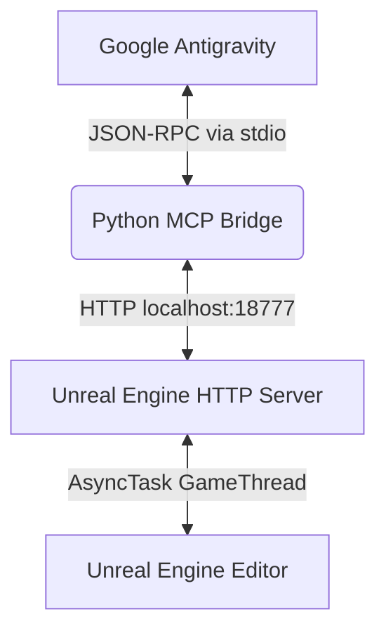

# UE-Antigravity

**UE-Antigravity** is a high-performance integration that connects the Google Antigravity 2.0 AI coding assistant directly to a running Unreal Engine Editor.

Exposed as a Model Context Protocol (MCP) server, it enables Antigravity to interact natively with your Unreal Engine projects, query schemas, run diagnostics, modify code, execute editor automation, and build Blueprints dynamically on the Game Thread.

---

## Key Features

Exposes **100+ advanced editor tools** categorized into specialized domains:

* **Blueprint Generation**: Create Blueprint actors, add variables/functions, connect pins, and inject node graphs.
* **Widget & UMG Editor**: Retrieve widget hierarchies, modify widget slots, set fonts, and bind interactive events.
* **C++ Integration**: Create classes, modify header and implementation source files, and trigger Live Coding compilation.
* **Python Editor Scripting**: Write and execute native Unreal Python scripts inside the editor process.
* **Performance & Scalability**: Read/write cvars, analyze asset sizes, run CSV profiling, and capture rendering metrics.
* **Enhanced Input**: Define input actions, manage input mapping contexts, and bind hardware mappings.
* **Gameplay AI & World Tools**: Edit Blackboard/Behavior Tree graphs, configure NavMesh bounds, and spawn actors.

---

## Repository Structure

This repository contains the following components and directories:

*   **[Antigravity](./Antigravity)**: The Unreal Engine Editor plugin. It runs an in-process HTTP loopback server to execute commands safely on the Game Thread.
*   **[UnrealEngine](./UnrealEngine)**: The Antigravity extension plugin (MCP Server). It registers the tools with the AI assistant and proxies JSON-RPC messages via a lightweight Python bridge to the Unreal HTTP server.
*   **[Documentation](./Documentation)**: Contains system documentation:
    *   [PROJECT.md](./Documentation/PROJECT.md): Overview of the Dual-MCP architecture, directory layout, and milestones.
    *   [DEVELOPMENT.md](./Documentation/DEVELOPMENT.md): Developer guide for environment setup, compilation, and AST server debugging.
    *   [TEST_INFRA.md](./Documentation/TEST_INFRA.md): Specifications of the E2E test harness and test matrix.
*   **[Tests](./Tests)**: Contains automated integration and unit tests:
    *   To run Python tests: `powershell -File .\Tests\run_tests.ps1`
    *   To run all C++ and Python tests sequentially: `powershell -File .\Tests\run_all_tests.ps1`



---

## How It Works (High-Level Architecture)

UE-Antigravity operates as a **Dual-MCP Server** system that links your AI coding assistant (e.g., Google Antigravity or Kilo Code) directly to your Unreal Engine environment:

1. **Internal C++ Editor Server**: The C++ plugin runs inside the active Unreal Editor process, listening on port `18777`. It performs game thread operations like reading Blueprint graphs, adding reflection variables, compiling assets, and injecting nodes.
2. **Python stdio Bridge**: Translates Model Context Protocol (MCP) standard input/output (stdio) requests from the AI assistant to local HTTP loopback calls targeting the editor.
3. **External Python AST Server**: Resolves C++ symbols and file structures using `libclang` and watches your C++ source directories. It caches class names, method signatures, properties, and called functions in a local SQLite database and refreshes them automatically whenever files are saved.

---

## Installation & Setup

You must install both the C++ editor plugin and the agent plugin to enable the integration.

### Step 1: Install Unreal Engine Editor Plugin

1. Navigate to the root directory of your game project.
2. Create a folder named `Plugins` at the root if it is missing.
3. Copy the [Antigravity](./Antigravity) folder into your project's `Plugins/` directory.
4. Open your project in Unreal Editor. If prompted to rebuild the plugin binaries, click **Yes**.
5. Ensure the plugin is loaded by opening **Edit > Plugins** and checking **Antigravity**.

### Step 2: Install Antigravity 2.0 Plugin (also supports Kilo Code)

We provide an automated installer script that sets up the Python bridge, links rule sets, and writes configuration files for your AI assistant in one step.

1. Open PowerShell and run the installer script:
   ```powershell
   powershell -ExecutionPolicy Bypass -File .\UnrealEngine\install.ps1
   ```
2. When prompted:
   * **Project Root**: Press Enter to install to the default workspace, or specify the path to your target project folder.
   * **LLM Profile**: Pick a default configuration profile (e.g., select `default` or `deepseek-v4`).
3. The installer will automatically:
   * Setup a Python virtual environment and install dependencies for the `bridge` proxy.
   * Install the plugin directory under `.agents/plugins/UnrealEngine`.
   * Create `mcp_config.json` to enable automatic server discovery for Antigravity.
   * Create or merge the server definitions inside `kilo.jsonc` for Kilo Code.

### Step 3: Run the Setup Conversation (One-time Setup)

Once the installer finishes:
1. Ensure your Unreal Editor is open and running.
2. Open a new conversation with your AI coding assistant in the project workspace.
3. Prompt the assistant to run the project setup:
   ```
   Run project setup and index the project
   ```
4. The assistant will detect the `unreal-setup` skill, generate the machine-specific `unreal-env` skill, perform a full scan of the C++ codebase, project settings, and active editor assets, and write a permanent OKF project-indexing skill at `.agents/skills/project-index/SKILL.md`.
5. **Restart the assistant session** or reload the window to ensure the new `project-index` skill is registered. This is required because the assistant platform only scans and loads workspace skills during conversation startup. Every subsequent session will benefit from this sophisticated, token-efficient architectural map.

---

## Verification & How to Use

Once both components are installed, you do not need to start any servers manually. Your AI assistant will automatically launch the C++ bridge and Python AST servers in the background.

To verify the setup, open your AI coding assistant inside the workspace and prompt it to run any of the following queries:

### 1. C++ AST & Header Analysis
Ask the assistant to analyze your C++ files or find class details:
* *"Find the declaration and inheritance chain for the class AWatchdogStressTarget"*
* *"List the parameters and return type for the method ExecPythonCommand"*

### 2. Live Blueprint & Reflection Queries
Ask the assistant to query active editor assets and runtime properties (Unreal Editor must be open):
* *"Extract the Blueprint variables and parent class of BP_RoundPawn"*
* *"Get the runtime reflection properties and metadata tags of AActor"*

### 3. Graph Injection
Ask the assistant to wire logic inside a Blueprint graph:
* *"Inject a custom variable getter node into the EventGraph of BP_RoundPawn"*
* *"Add a sequence node and format the layout so they do not overlap"*

---

## Acknowledgements

This project was adapted from [PRQELT/Autonomix](https://github.com/PRQELT/Autonomix).

---

## License

This project is licensed under the MIT License. You are free to copy, modify, distribute, sublicense, and sell copies of the software under a different name, provided the original copyright and permission notices are included in all copies.
